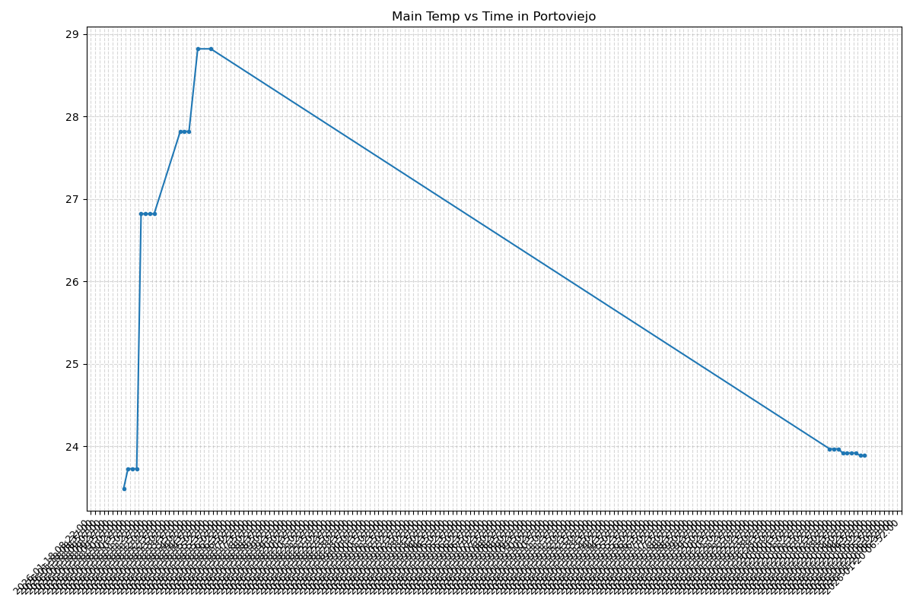
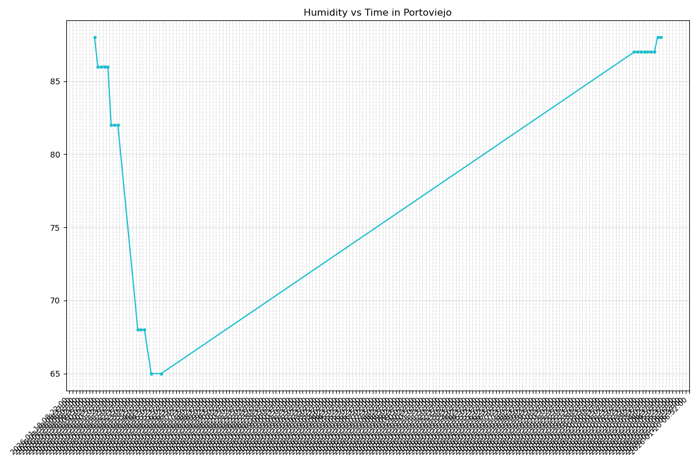
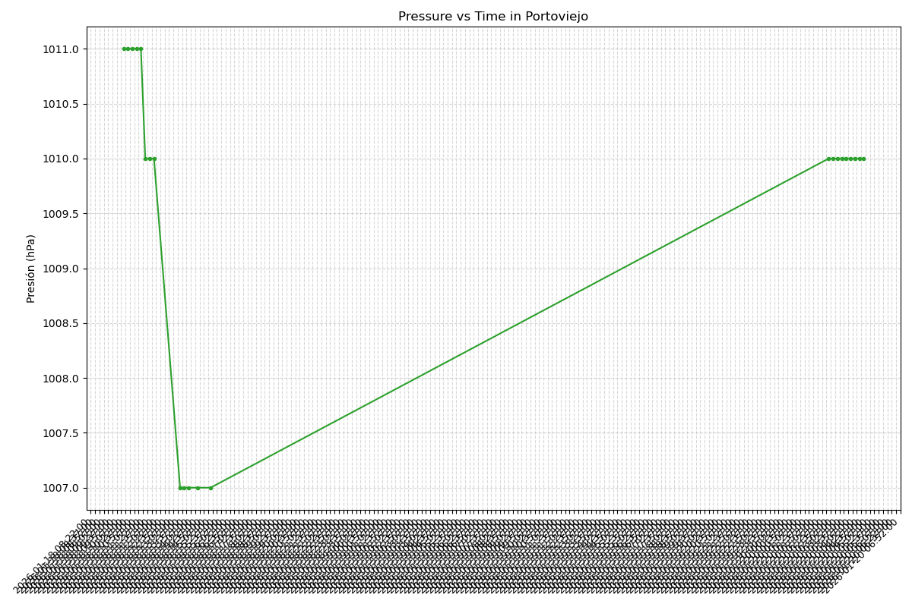

#+options: ':nil *:t -:t ::t <:t H:3 \n:nil ^:t arch:headline
#+options: author:t broken-links:nil c:nil creator:nil
#+options: d:(not "LOGBOOK") date:t e:t email:nil expand-links:t f:t
#+options: inline:t num:t p:nil pri:nil prop:nil stat:t tags:t
#+options: tasks:t tex:t timestamp:t title:t toc:t todo:t |:t
#+title: Proyecto ICCD332 Arquitectura de Computadores
#+date: 2024-08-07
#+author: Alejandro Navarrete; Samuel Crespo; Elvis Carlosama & Juan Quinatoa.
#+email: dennis.navarrete@epn.edu.ec
#+language: es
#+select_tags: export
#+exclude_tags: noexport
#+creator: Emacs 27.1 (Org mode 9.7.5)
#+cite_export:
* City Weather APP
Este es el proyecto de fin de semestre en donde se pretende demostrar
las destrezas obtenidas durante el transcurso de la asignatura de
**Arquitectura de Computadores**.

1. Conocimientos de sistema operativo Linux
2. Conocimientos de Emacs/Jupyter
3. Configuración de Entorno para Data Science con Mamba/Anaconda
4. Literate Programming
 
** Estructura del proyecto
Se recomienda que el proyecto se cree en el /home/ del sistema
operativo i.e. /home/<user>/. Allí se creará la carpeta /PortoviejoWeather/
#+begin_src shell :results output :exports both
# 1. Definimos el directorio principal en home.
DIR_PROYECTO=~/PortoviejoWeather
# 2.Crear la estructura de directorios.
mkdir -p $DIR_PROYECTO/weather-site/content/images
mkdir -p $DIR_PROYECTO/weather-site/public/images
# 3. Entrar al directorio
cd $DIR_PROYECTO
# 4. Crear los archivos vacíos necesarios en la raíz
touch CityTemperatureAnalysis.ipynb
touch clima-portoviejo-hoy.csv
touch get-weather.sh
touch main.py
touch output.log
# 5. Crear los scripts de configuración del sitio
touch weather-site/build-site.el
touch weather-site/build.sh
# 6. Crear los archivos de contenido y web
touch weather-site/content/index.org
touch weather-site/content/index.org_archive
touch weather-site/public/index.html
# 7. Crear placeholders para imágenes.
touch weather-site/content/images/plot.png
touch weather-site/content/images/temperature.png
touch weather-site/public/images/plot.png
touch weather-site/public/images/temperature.png
# 8. Verfica la posición actual.
echo "Estructura creada en:"
pwd
#+end_src

#+RESULTS:
: Estructura creada en:
: /home/alejandro/PortoviejoWeather

El proyecto ha de tener los siguientes archivos y
subdirectorios. Adaptar los nombres de los archivos según las ciudades
específicas del grupo.

#+begin_src shell :results output :exports results
cd
cd ~/PortoviejoWeather
tree
#+end_src

#+RESULTS:
#+begin_example
.
├── CityTemperatureAnalysis.ipynb
├── clima-portoviejo-hoy.csv
├── get-weather.sh
├── images
│   ├── humidity.png
│   ├── pressure.png
│   └── temperature_style.png
├── main.py
├── output.log
├── public
│   └── images
│       ├── humidity.png
│       ├── pressure.png
│       └── temperature_style.png
└── weather-site
    ├── build-site.el
    ├── build.sh
    ├── content
    │   ├── images
    │   │   ├── humidity.png
    │   │   ├── pressure.png
    │   │   └── temperature_style.png
    │   ├── index.org
    │   └── index.org_archive
    └── public
        ├── images
        │   ├── humidity.png
        │   ├── pressure.png
        │   └── temperature_style.png
        └── index.html

9 directories, 22 files
#+end_example

** Formulación del Problema
Se desea realizar un registro climatológico de una ciudad
$\mathcal{C}$. Para esto, escriba un script de Python/Java que permita
obtener datos climatológicos desde el API de [[https://openweathermap.org/current#one][openweathermap]]. El API
hace uso de los valores de latitud $x$ y longitud $y$ de la ciudad
$\mathcal{C}$ para devolver los valores actuales a un tiempo $t$.

Los resultados obtenidos de la consulta al API se escriben en un
archivo /clima-<ciudad>-hoy.csv/. Cada ejecución del script debe
almacenar nuevos datos en el archivo. Utilice *crontab* y sus
conocimientos de Linux y Programación para obtener datos del API de
/openweathermap/ con una periodicidad de 15 minutos mediante la
ejecución de un archivo ejecutable denominado
/get-weather.sh/. Obtenga al menos 50 datos. Verifique los
resultados. Todas las operaciones se realizan en Linux o en el
WSL. Las etapas del problema se subdividen en:

    1. Conformar los grupos de 2 estudiantes y definir la ciudad
       objeto de estudio.
    2.  Crear su API gratuito en [[https://openweathermap.org/current#one][openweathermap]]
    3. Escribir un script en Python/Java que realice la consulta al
       API y escriba los resultados en /clima-<ciudad>-hoy.csv/. El
       archivo ha de contener toda la información que se obtiene del
       API en columnas. Se debe observar que los datos sobre lluvia
       (rain) y nieve (snow) se dan a veces si existe el fenómeno.
    4. Desarrollar un ejecutable /get-weather.sh/ para ejecutar el
       programa Python/Java.[fn:1]
    #+begin_src python :tangle "/home/alejandro/PortoviejoWeather/main.py" :shebang "#!/usr/bin/env python" :results output :python /home/alejandro/miniforge3/envs/iccd332/bin/python
import requests
import pandas as pd
from datetime import datetime
import os
# 1. Configuración inicial. 
API_KEY = "bd5cf379b6d6b7d080073db8791dd9eb"
LAT = "-1.0546"
LON = "-80.4544"
URL = f"https://api.openweathermap.org/data/2.5/weather?lat={LAT}&lon={LON}&appid={API_KEY}&units=metric"
CSV_PATH = '/home/alejandro/PortoviejoWeather/clima-portoviejo-hoy.csv'
# 2. Configuración para el CSV.
EXPECTED_COLUMNS = [
    'dt', 'coord_lon', 'coord_lat', 'weather_0_id', 'weather_0_main', 
    'weather_0_description', 'weather_0_icon', 'base', 'main_temp', 
    'main_feels_like', 'main_temp_min', 'main_temp_max', 'main_pressure', 
    'main_humidity', 'main_sea_level', 'main_grnd_level', 'visibility', 
    'wind_speed', 'wind_deg', 'wind_gust', 'clouds_all', 'sys_type', 
    'sys_id', 'sys_country', 'sys_sunrise', 'sys_sunset', 'timezone', 
    'id', 'name', 'cod'
]
# 3. Funciones necesarias.
def get_weather():
    try:
        response = requests.get(URL)
        if response.status_code == 200:
            data = response.json()
            # 1. Sacar 'weather' de la lista
            if 'weather' in data and len(data['weather']) > 0:
                w = data.pop('weather')[0]
                for k, v in w.items():
                    data[f"weather_0_{k}"] = v
                    # 2. Aplanar JSON
            df = pd.json_normalize(data, sep='_')
            # 3. Convertir fechas
            for col in ['dt', 'sys_sunrise', 'sys_sunset']:
                if col in df.columns:
                    df[col] = pd.to_datetime(df[col], unit='s') - pd.Timedelta(hours=5)
                    # 4. Forzar columnas exactas
            df = df.reindex(columns=EXPECTED_COLUMNS)
            # 5. Guardar en CSV
            if not os.path.isfile(CSV_PATH):
                df.to_csv(CSV_PATH, index=False, header=True)
            else:
                df.to_csv(CSV_PATH, mode='a', index=False, header=False)
                # Impresión de registros.
            fecha_actual = df['dt'].iloc[0]
            print(f"Éxito: Dato registrado para Portoviejo a las {fecha_actual}")
        else:
            print(f"Error API: {response.status_code}")
    except Exception as e:
        print(f"Error: {e}")
if __name__ == "__main__":
    get_weather()
    #+end_src
    #+RESULTS:
    : Éxito: Dato registrado para Portoviejo a las 2026-01-18 10:30:05

    5. Configurar Crontab para la adquisición de datos. Escriba el
       comando configurado. Respalde la ejecución de crontab en un
       archivo output.log
       ** Configuración de Crontab
    #+begin_src shell :results output :exports both
# Comando de crontab para ejecución cada 15 minutos
# */15 * * * * /home/alejandro/miniforge3/envs/iccd332/bin/python /home/alejandro/PortoviejoWeather/main.py >> /home/alejandro/PortoviejoWeather/output.log 2>&1
echo "Crontab configurado correctamente para ejecución cada 15 minutos."
    #+end_src

    #+RESULTS:
    : Crontab configurado correctamente para ejecución cada 15 minutos.

    5. [@5] Realizar la presentación del Trabajo utilizando la generación
       del sitio web por medio de Emacs. Para esto es necesario crear
       la carpeta **weather-site** dentro del proyecto. Puede ajustar el
       /look and feel/ según sus preferencias. El servidor a usar es
       el **simple-httpd** integrado en Emacs que debe ser instalado:
       - Usando comandos Emacs: ~M-x package-install~ presionamos
         enter (i.e. RET) y escribimos el nombre del paquete:
         simple-httpd
       - Configurando el archivo init.el

    #+begin_src elisp
(use-package simple-httpd
:ensure t)
    #+end_src

    6. [@6] Detalles de cambios del archivo Build.el
    Se detallan los estilos específicos inyectados para lograr la estética visual del sitio.

    1. [@1] Colores Base y Márgenes
    Se define el fondo negro absoluto para el modo "Ultra-Dark" y se
    establece el margen izquierdo vital para que el
    contenido no quede oculto bajo la barra lateral.

    #+begin_src css :results none :exports code
    /* Fondo negro y texto blanco */
body {
  background-color: #000000;
  color: #ffffff;
}
    /* Desplazamiento para respetar la Sidebar fija */
#content {
  margin-left: 320px;
  max-width: 900px;
}
    #+end_src

    2. [@2] Efecto "Glow" en Código
    Este es el estilo que hace que los bloques de código brillen al pasar
    el mouse. Se utiliza una
    sombra de caja difusa (=box-shadow=) blanca.

    #+begin_src css :results none :exports code
    /* Glow blanco al pasar el cursor sobre el código */
pre.src:hover {
  border-color: #ffffff;
  box-shadow: 0 0 80px 20px rgba(255, 255, 255, 0.25);
  transform: translateY(-5px);
}
    #+end_src

    3. [@3] Efecto "Neon" en Imágenes
    Para las gráficas, se aplica un resplandor rojo intenso en el
    estado =hover= para resaltarlas sobre el fondo oscuro.

   #+begin_src css :results none :exports code
/* Glow rojo intenso para las imágenes */
img:hover {
  border-color: #ff0000;
  box-shadow: 0 0 100px 30px rgba(255, 0, 0, 0.45);
  transform: scale(1.03);
}
   #+end_src
       
   7. [@7] Su código debe estar respaldado en GitHub/BitBucket, la dirección será remitida en la contestación de la tarea.
   #+begin_src shell :results output :exports both :eval no
# 1. Navegar al directorio del proyecto
cd /home/alejandro/PortoviejoWeather
# 2. Configurar Identidad en Git.
git config --global user.name "Alejandro Navarrete"
git config --global user.email "dennis.navarrete@epn.edu.ec"
# 3. Inicializar repositorio (si no existe)
if [ ! -d ".git" ]; then
    git init
    echo "Repositorio inicializado."
fi
# 4. Configurar la rama principal
git branch -M main
# 5. Añadir archivos y realizar commit
git add .
# El '|| true' para evitar detenciones si ya se realizó el proceso anteriormente.
git commit -m "Entrega Final: Proyecto PortoviejoWeather" || echo "Nada nuevo que guardar"
# 6. Configurar GitHub
git remote remove origin || true
git remote add origin https://github.com/dannstrak/PortoviejoWeather.git
# 7. Subir a GitHub
git push -u origin main
   #+end_src

   #+RESULTS:
: [main ba1d222] Entrega Final: Proyecto PortoviejoWeather
:  2 files changed, 2 insertions(+)
  
** Descripción del código
A continuación se detalla el funcionamiento del script principal
=main.py=.
Estrategia de Solución
La estrategia adoptada para resolver el problema de monitoreo
climático en Portoviejo se basa en la implementación de una
arquitectura de **Pipeline de Datos Automatizado**.
Esta solución se divide en tres capas lógicas.

A continuación se detallan los pilares de esta estrategia:

1. Arquitectura ETL (Extract, Transform, Load)
Para garantizar un flujo de datos constante sin intervención manual, se diseñó un proceso ETL ligero utilizando Python:
- **Extracción (Extract):** Se consume la API de OpenWeatherMap cada
  15 minutos. Se eligió esta frecuencia para obtener una granularidad
  suficiente que permita observar micro-variaciones en la temperatura
  y humedad sin exceder la cuota gratuita de la API.
- **Transformación (Transform):** Los datos crudos en formato JSON
  (anidados) se normalizan a una estructura tabular plana. Se realiza
  una conversión de zona horaria (UTC a UTC-5) para que los datos sean relevantes.
- **Carga (Load):** Se utiliza un mecanismo de almacenamiento
  incremental (=append mode=) en un archivo CSV. Esto evita la
  necesidad de una base de datos compleja (como SQL) para este volumen
  de datos, manteniendo el proyecto portable y ligero.

2. [@2] Automatización mediante Cron Jobs
La fiabilidad del sistema depende de su ejecución autónoma. Se
implementó una tarea programada en el sistema operativo Linux
(usando =crontab=) que ejecuta el script =main.py= estrictamente cada
15 minutos.
Esto asegura que la serie temporal no tenga "huecos" significativos y
que el
dataset crezca orgánicamente las 24 horas del día.

3. [@3] Generación de Reportes Estáticos (Dataflow Visual)
Para la capa de presentación, se descartó el uso de dashboards
dinámicos pesados (como PowerBI o Grafana) en favor de un enfoque de
**Sitio Web Estático**
generado con Emacs Org-mode.
La estrategia consiste en:
1.  Utilizar **Matplotlib** para generar gráficas estáticas actualizadas basadas en el histórico del CSV.
2.  Incrustar estas imágenes automáticamente en un documento principal (.org).
3.  Compilar el documento a HTML/CSS  para su publicación web.

- Importación de Librerías
Se inicia importando los módulos necesarios: =requests= para la
comunicación HTTP con la API, =pandas= para la
estructuración de datos, y librerías del sistema para manejo de fechas y archivos.

#+begin_src python :results none :exports code
import requests
import pandas as pd
from datetime import datetime
import os
#+end_src

- Configuración Inicial y Constantes
Se definen las constantes globales que controlan la ejecución: la
credencial de acceso (API Key), las coordenadas
geográficas de Portoviejo y la ruta donde se almacenará el historial climático.

#+begin_src python :results none :exports code
# 1. Configuración inicial.
API_KEY = "bd5cf379b6d6b7d080073db8791dd9eb"
LAT = "-1.0546"
LON = "-80.4544"
URL = f"https://api.openweathermap.org/data/2.5/weather?lat={LAT}&lon={LON}&appid={API_KEY}&units=metric"
CSV_PATH = '/home/alejandro/PortoviejoWeather/clima-portoviejo-hoy.csv'
#+end_src

- Definición del Esquema del CSV
Para garantizar la consistencia de los datos a largo plazo, se define
una lista estricta de columnas (=EXPECTED_COLUMNS=).
Esto actúa como un molde para asegurar que el CSV siempre tenga la misma estructura.

#+begin_src python :results none :exports code
# 2. Configuración para el CSV.
EXPECTED_COLUMNS = [
    'dt', 'coord_lon', 'coord_lat', 'weather_0_id', 'weather_0_main', 
    'weather_0_description', 'weather_0_icon', 'base', 'main_temp', 
    'main_feels_like', 'main_temp_min', 'main_temp_max', 'main_pressure', 
    'main_humidity', 'main_sea_level', 'main_grnd_level', 'visibility', 
    'wind_speed', 'wind_deg', 'wind_gust', 'clouds_all', 'sys_type', 
    'sys_id', 'sys_country', 'sys_sunrise', 'sys_sunset', 'timezone', 
    'id', 'name', 'cod'
]
#+end_src

- Petición al Servidor
La función principal comienza realizando una petición =GET= a la URL
configurada. Se valida que el código de estado sea 200 (OK) antes de proceder.

#+begin_src python :results none :exports code
# 3. Funciones necesarias.
def get_weather():
    try:
        response = requests.get(URL)
        if response.status_code == 200:
            data = response.json()
#+end_src

- Procesamiento de Datos Anidados
La API devuelve la información del clima dentro de una lista bajo la
clave ='weather'=. Este segmento extrae el primer elemento de esa
lista y lo aplana dentro del diccionario principal para evitar problemas al convertirlo a tabla.

#+begin_src python :results none :exports code
            # 1. Sacar 'weather' de la lista
            if 'weather' in data and len(data['weather']) > 0:
                w = data.pop('weather')[0]
                for k, v in w.items():
                    data[f"weather_0_{k}"] = v
#+end_src

- Normalización a DataFrame
Utilizamos la función =json_normalize= de Pandas para convertir el
objeto JSON (diccionario) en una
fila de datos tabular plana, usando el guion bajo como separador.

#+begin_src python :results none :exports code
            # 2. Aplanar JSON
            df = pd.json_normalize(data, sep='_')
#+end_src

- Conversión de Zona Horaria
Los tiempos recibidos están en formato UNIX (segundos). En este bloque
se convierten a formato =datetime= legible y se restan 5 horas (=Timedelta(hours=5)=) para ajustar los datos a la hora local de Ecuador.

#+begin_src python :results none :exports code
            # 3. Convertir fechas
            for col in ['dt', 'sys_sunrise', 'sys_sunset']:
                if col in df.columns:
                    df[col] = pd.to_datetime(df[col], unit='s') - pd.Timedelta(hours=5)
#+end_src

- Validación de Columnas
Se fuerza al DataFrame a cumplir con el esquema definido en el paso 3
mediante =reindex=. Esto previene errores si la API llegara a omitir algún campo opcional (como =wind_gust=).

#+begin_src python :results none :exports code
            # 4. Forzar columnas exactas
            df = df.reindex(columns=EXPECTED_COLUMNS)
#+end_src

- Persistencia en Disco (Append)
Esta lógica maneja el almacenamiento. Si el archivo no existe, lo crea
con encabezados. Si ya existe, simplemente anexa la nueva fila al final (=mode='a'=) sin duplicar la cabecera.

#+begin_src python :results none :exports code
            # 5. Guardar en CSV
            if not os.path.isfile(CSV_PATH):
                df.to_csv(CSV_PATH, index=False, header=True)
            else:
                df.to_csv(CSV_PATH, mode='a', index=False, header=False)
            
            # Impresión de registros.
            fecha_actual = df['dt'].iloc[0]
            print(f"Éxito: Dato registrado para Portoviejo a las {fecha_actual}")
#+end_src

- Manejo de Errores y Ejecución
Finalmente, se cierran los bloques condicionales manejando errores de conexión o excepciones generales, y se define el punto de entrada del script.

#+begin_src python :results none :exports code
        else:
            print(f"Error API: {response.status_code}")
    except Exception as e:
        print(f"Error: {e}")

if __name__ == "__main__":
    get_weather()
#+end_src

** Script ejecutable sh
Se coloca el contenido del script ejecutable. Recuerde que se debe
utilizar el entorno de **anaconda/mamba** denominado **iccd332** para
la ejecución de Python; independientemente de que tenga una
instalación nativa de Python

En el caso de los shell script se puede usar `which sh` para conocer
la ubicación del ejecutable
#+begin_src shell :results output :exports both
which sh
#+end_src

#+RESULTS:
: /usr/bin/sh

De igual manera se requiere localizar el entorno de mamba *iccd332*
que será utilizado

#+begin_src shell :results output :exports both
which mamba
#+end_src

#+RESULTS:
: /home/alejandro/miniforge3/condabin/mamba

Con esto el archivo ejecutable a de tener (adapte el código según las
condiciones de su máquina):

#+begin_src shell :tangle "/home/alejandro/PortoviejoWeather/get-weather.sh" :shebang "#!/bin/bash"
#!/bin/bash
source /home/alejandro/miniforge3/etc/profile.d/conda.sh
eval "$(conda shell.bash hook)"
conda activate iccd332
cd /home/alejandro/PortoviejoWeather
python main.py
#+end_src

#+RESULTS:
: Éxito: Dato registrado para Portoviejo a las 2026-01-18 13:43:29

Finalmente convierta en ejecutable como se explicó en clases y laboratorio.
#+begin_src shell :results output :exports both
chmod +x /home/alejandro/PortoviejoWeather/get-weather.sh
#+end_src 

#+RESULTS:

** Configuración de Crontab
Se indica la configuración realizada en crontab para la adquisición de datos

#+begin_src shell
*/15 * * * * /home/alejandro/miniforge3/envs/iccd332/bin/python /home/alejandro/PortoviejoWeather/main.py >> /home/alejandro/PortoviejoWeather/output.log 2>&1
#+end_src

#+RESULTS:

- Recuerde remplazar <City> por el nombre de la ciudad que analice
- Recuerde ajustar el tiempo para potenciar tomar datos nuevos
- Recuerde que ~2>&1~ permite guardar en ~output.log~ tanto la salida
  del programa como los errores en la ejecución.

  
* Presentación de resultados
Para la pressentación de resultados se utilizan las librerías de Python:
- matplotlib
- pandas

Alternativamente como pudo estudiar en el Jupyter Notebook
[[https://github.com/LeninGF/EPN-Lectures/blob/main/iccd332ArqComp-2024-A/Proyectos/CityWeather/CityTemperatureAnalysis.ipynb][CityTemperatureAnalysis.ipynb]], existen librerías alternativas que se
pueden utilizar para presentar los resultados gráficos. En ambos
casos, para que funcione los siguientes bloques de código, es
necesario que realice la instalación de los paquetes usando ~mamba
install <nombre-paquete>~

** Muestra Aleatoria de datos
#+begin_src python :results output :exports both :python /home/alejandro/miniforge3/envs/iccd332/bin/python
import os
import pandas as pd
df = pd.read_csv('/home/alejandro/PortoviejoWeather/clima-portoviejo-hoy.csv')
print(f"Dataset cargado. Filas: {df.shape[0]}, Columnas: {df.shape[1]}")
#+end_src

#+RESULTS:
: Dataset cargado. Filas: 27, Columnas: 30

#+begin_src python :results value table :exports both :return table :python /home/alejandro/miniforge3/envs/iccd332/bin/python
import pandas as pd
df = pd.read_csv('/home/alejandro/PortoviejoWeather/clima-portoviejo-hoy.csv')
# Tomamos la muestra
n = min(10, len(df))
sample = df.sample(n)
# Para que salga la línea divisoria |---| en Org-mode, debemos insertar 'None'
# entre los encabezados y los datos.
headers = list(sample.columns)
data = sample.values.tolist()

table = [headers] + [None] + data
table
#+end_src
#+RESULTS:
| dt                  | coord_lon | coord_lat | weather_0_id | weather_0_main | weather_0_description | weather_0_icon | base     | main_temp | main_feels_like | main_temp_min | main_temp_max | main_pressure | main_humidity | main_sea_level | main_grnd_level | visibility | wind_speed | wind_deg | wind_gust | clouds_all | sys_type | sys_id | sys_country | sys_sunrise         | sys_sunset          | timezone |      id | name       | cod |
|---------------------+-----------+-----------+--------------+----------------+-----------------------+----------------+----------+-----------+-----------------+---------------+---------------+---------------+---------------+----------------+-----------------+------------+------------+----------+-----------+------------+----------+--------+-------------+---------------------+---------------------+----------+---------+------------+-----|
| 2026-01-18 11:15:06 |  -80.4544 |   -1.0546 |          804 | Clouds         | overcast clouds       |            04d | stations |     26.82 |           29.86 |         26.82 |         26.82 |          1011 |            86 |           1011 |            1006 |      10000 |       0.59 |      222 |       1.0 |        100 |      1.0 | 8552.0 | EC          | 2026-01-18 06:26:55 | 2026-01-18 18:37:10 |   -18000 | 3652941 | Portoviejo | 200 |
| 2026-01-18 12:00:05 |  -80.4544 |   -1.0546 |          804 | Clouds         | overcast clouds       |            04d | stations |     26.82 |           29.51 |         26.82 |         26.82 |          1010 |            82 |           1010 |            1005 |      10000 |       1.01 |      250 |      1.26 |        100 |      1.0 | 8552.0 | EC          | 2026-01-18 06:26:55 | 2026-01-18 18:37:10 |   -18000 | 3652941 | Portoviejo | 200 |
| 2026-01-18 11:30:05 |  -80.4544 |   -1.0546 |          804 | Clouds         | overcast clouds       |            04d | stations |     26.82 |           29.51 |         26.82 |         26.82 |          1010 |            82 |           1010 |            1005 |      10000 |       1.01 |      250 |      1.26 |        100 |      1.0 | 8552.0 | EC          | 2026-01-18 06:26:55 | 2026-01-18 18:37:10 |   -18000 | 3652941 | Portoviejo | 200 |
| 2026-01-18 10:30:05 |  -80.4544 |   -1.0546 |          804 | Clouds         | overcast clouds       |            04d | stations |     23.73 |            24.4 |         23.73 |         23.73 |          1011 |            86 |           1011 |            1006 |      10000 |       0.59 |      222 |       1.0 |        100 |      nan |    nan | EC          | 2026-01-18 06:26:55 | 2026-01-18 18:37:10 |   -18000 | 3652941 | Portoviejo | 200 |
| 2026-01-18 10:15:06 |  -80.4544 |   -1.0546 |          500 | Rain           | light rain            |            10d | stations |     23.49 |           24.19 |         23.49 |         23.49 |          1011 |            88 |           1011 |            1006 |      10000 |       0.89 |      227 |      1.35 |        100 |      nan |    nan | EC          | 2026-01-18 06:26:55 | 2026-01-18 18:37:10 |   -18000 | 3652941 | Portoviejo | 200 |
| 2026-01-18 11:00:06 |  -80.4544 |   -1.0546 |          804 | Clouds         | overcast clouds       |            04d | stations |     23.73 |            24.4 |         23.73 |         23.73 |          1011 |            86 |           1011 |            1006 |      10000 |       0.59 |      222 |       1.0 |        100 |      nan |    nan | EC          | 2026-01-18 06:26:55 | 2026-01-18 18:37:10 |   -18000 | 3652941 | Portoviejo | 200 |
| 2026-01-18 11:45:05 |  -80.4544 |   -1.0546 |          804 | Clouds         | overcast clouds       |            04d | stations |     26.82 |           29.51 |         26.82 |         26.82 |          1010 |            82 |           1010 |            1005 |      10000 |       1.01 |      250 |      1.26 |        100 |      1.0 | 8552.0 | EC          | 2026-01-18 06:26:55 | 2026-01-18 18:37:10 |   -18000 | 3652941 | Portoviejo | 200 |
| 2026-01-18 13:30:03 |  -80.4544 |   -1.0546 |          804 | Clouds         | overcast clouds       |            04d | stations |     27.82 |           30.08 |         27.82 |         27.82 |          1007 |            68 |           1007 |            1003 |      10000 |       2.07 |      300 |       2.2 |         96 |      1.0 | 8552.0 | EC          | 2026-01-18 06:26:55 | 2026-01-18 18:37:10 |   -18000 | 3652941 | Portoviejo | 200 |
| 2026-01-18 13:43:29 |  -80.4544 |   -1.0546 |          804 | Clouds         | overcast clouds       |            04d | stations |     27.82 |           30.08 |         27.82 |         27.82 |          1007 |            68 |           1007 |            1003 |      10000 |       2.07 |      300 |       2.2 |         96 |      1.0 | 8552.0 | EC          | 2026-01-18 06:26:55 | 2026-01-18 18:37:10 |   -18000 | 3652941 | Portoviejo | 200 |
| 2026-01-18 10:45:05 |  -80.4544 |   -1.0546 |          804 | Clouds         | overcast clouds       |            04d | stations |     23.73 |            24.4 |         23.73 |         23.73 |          1011 |            86 |           1011 |            1006 |      10000 |       0.59 |      222 |       1.0 |        100 |      nan |    nan | EC          | 2026-01-18 06:26:55 | 2026-01-18 18:37:10 |   -18000 | 3652941 | Portoviejo | 200 |

* Gráfica de la Temperatura en el Tiempo.

El siguiente cógido permite hacer la gráfica de la temperatura vs
tiempo para Org 9.7+. Para saber que versión dispone puede ejecutar
~M-x org-version~

#+begin_src python :results file :exports both :python /home/alejandro/miniforge3/envs/iccd332/bin/python
import matplotlib.pyplot as plt
import matplotlib.dates as mdates
import pandas as pd
import os

csv_path = '/home/alejandro/PortoviejoWeather/clima-portoviejo-hoy.csv'

if not os.path.exists(csv_path):
    print("Error: No existe el archivo CSV")
else:
    df = pd.read_csv(csv_path)
    df['dt'] = pd.to_datetime(df['dt'])
    df = df.sort_values('dt')

    output_dir = '/home/alejandro/PortoviejoWeather/weather-site/content/images'
    os.makedirs(output_dir, exist_ok=True)

    fig = plt.figure(figsize=(12, 8))
    plt.plot(df['dt'], df['main_temp'], linestyle='-', marker='o', markersize=3, color='tab:blue')

    ax = plt.gca()
    # CAMBIO: Formato de fecha largo y marcas cada 15 minutos
    ax.xaxis.set_major_formatter(mdates.DateFormatter('%Y-%m-%d %H:%M:%S'))
    ax.xaxis.set_major_locator(mdates.MinuteLocator(interval=15))

    # CAMBIO: Rotación a 45 grados y alineación a la derecha como en tu imagen
    plt.xticks(rotation=45, ha='right', fontsize=9)
    plt.grid(True, linestyle='--', alpha=0.5)
    
    plt.title(f"Main Temp vs Time in {df['name'].iloc[0]}")
    plt.tight_layout()

    fname = os.path.join(output_dir, 'temperature_style.png')
    plt.savefig(fname)
    return "./images/temperature_style.png"
#+end_src

#+RESULTS:

**  Gráfica de Humedad con respecto al Tiempo.
#+begin_src python :results file :exports both :python /home/alejandro/miniforge3/envs/iccd332/bin/python
import matplotlib.pyplot as plt
import matplotlib.dates as mdates
import pandas as pd
import os

csv_path = '/home/alejandro/PortoviejoWeather/clima-portoviejo-hoy.csv'

if not os.path.exists(csv_path):
    print("Error: No existe el archivo CSV")
else:
    df = pd.read_csv(csv_path)
    df['dt'] = pd.to_datetime(df['dt'])
    df = df.sort_values('dt')

    output_dir = '/home/alejandro/PortoviejoWeather/weather-site/content/images'
    os.makedirs(output_dir, exist_ok=True)

    fig = plt.figure(figsize=(12, 8))
    plt.plot(df['dt'], df['main_humidity'], linestyle='-', marker='o', markersize=3, color='tab:cyan')

    ax = plt.gca()
    ax.xaxis.set_major_formatter(mdates.DateFormatter('%Y-%m-%d %H:%M:%S'))
    ax.xaxis.set_major_locator(mdates.MinuteLocator(interval=15))

    # Rotación exacta a la de la imagen
    plt.xticks(rotation=45, ha='right', fontsize=9)
    plt.grid(True, linestyle='--', alpha=0.5)
    
    plt.title(f"Humidity vs Time in {df['name'].iloc[0]}")
    plt.tight_layout()

    fname = os.path.join(output_dir, 'humidity.png')
    plt.savefig(fname)
    return "./images/humidity.png"
#+end_src
#+RESULTS:

** Gráfica de Presión Atmosférica.
#+begin_src python :results file :exports both :python /home/alejandro/miniforge3/envs/iccd332/bin/python
import matplotlib.pyplot as plt
import matplotlib.dates as mdates
import pandas as pd
import os

csv_path = '/home/alejandro/PortoviejoWeather/clima-portoviejo-hoy.csv'

if not os.path.exists(csv_path):
    print("Error: No existe el archivo CSV")
else:
    df = pd.read_csv(csv_path)
    df['dt'] = pd.to_datetime(df['dt'])
    df = df.sort_values('dt')

    output_dir = '/home/alejandro/PortoviejoWeather/weather-site/content/images'
    os.makedirs(output_dir, exist_ok=True)

    fig = plt.figure(figsize=(12, 8))
    plt.plot(df['dt'], df['main_pressure'], linestyle='-', marker='o', markersize=3, color='tab:green')

    ax = plt.gca()
    ax.xaxis.set_major_formatter(mdates.DateFormatter('%Y-%m-%d %H:%M:%S'))
    ax.xaxis.set_major_locator(mdates.MinuteLocator(interval=15))

    plt.xticks(rotation=45, ha='right', fontsize=9)
    plt.grid(True, linestyle='--', alpha=0.5)
    
    plt.title(f"Pressure vs Time in {df['name'].iloc[0]}")
    plt.ylabel('Presión (hPa)')
    plt.tight_layout()

    fname = os.path.join(output_dir, 'pressure.png')
    plt.savefig(fname)
    return "./images/pressure.png"
#+end_src

#+RESULTS:

* Sincronización y Configuración del Servidor
Debido a que el archivo ~index.org~ utiliza rutas relativas
(~./images/~) para ser compatible con la exportación web,
es necesario asegurar que las imágenes generadas por Python en la carpeta ~/content/images/~ se copien a la carpeta ~/public/images/~.

#+begin_src shell :results output
# 1. Definir rutas del proyecto
SITE_DIR="/home/alejandro/PortoviejoWeather/weather-site"
IMG_CONTENT="$SITE_DIR/content/images/"
IMG_PUBLIC="$SITE_DIR/public/images/"

# 2. Crear carpetas si no existen
mkdir -p "$IMG_CONTENT"
mkdir -p "$IMG_PUBLIC"

# 3. Sincronizar imágenes desde content hacia public
if [ "$(ls -A $IMG_CONTENT)" ]; then
    cp -rfv "$IMG_CONTENT"* "$IMG_PUBLIC"
    echo "Sincronización: Imágenes copiadas de content a public."
else
    echo "Error: La carpeta content/images está vacía. Ejecute los bloques de Python primero."
fi
#+end_src

#+RESULTS:
: '/home/alejandro/PortoviejoWeather/weather-site/content/images/humidity.png' -> '/home/alejandro/PortoviejoWeather/weather-site/public/images/humidity.png'
: '/home/alejandro/PortoviejoWeather/weather-site/content/images/pressure.png' -> '/home/alejandro/PortoviejoWeather/weather-site/public/images/pressure.png'
: '/home/alejandro/PortoviejoWeather/weather-site/content/images/temperature_style.png' -> '/home/alejandro/PortoviejoWeather/weather-site/public/images/temperature_style.png'
: Sincronización: Imágenes copiadas de content a public.

* Generación del Sitio Web
Presiona ~C-c C-c~ para actualizar la estructura de archivos y reconstruir el HTML con el estilo CSS moderno.

#+begin_src shell :results output
# 1. Definir rutas
SITE_DIR="/home/alejandro/PortoviejoWeather/weather-site"
ORIGEN="/home/alejandro/EPN-Lectures/iccd332ArqComp-2024-B/Proyectos/index.org"
DESTINO="$SITE_DIR/content/index.org"

# 2. Copiar el index.org más reciente a la carpeta de content.
cp "$ORIGEN" "$DESTINO"
echo "Archivo index.org actualizado."

# 3. Ejecutar la construcción del sitio
cd "$SITE_DIR"
chmod +x build.sh
./build.sh

echo "--- PROCESO FINALIZADO: Sitio web actualizado y listo para visualizar ---"
#+end_src

#+RESULTS:
: Archivo index.org actualizado.
: --- PROCESO FINALIZADO: Sitio web actualizado y listo para visualizar ---

* Footnotes

[fn:1] Recuerde que su máquina ha de disponer de un entorno de
anaconda/mamba denominado iccd332 en el cual se dispone del interprete
de Python
